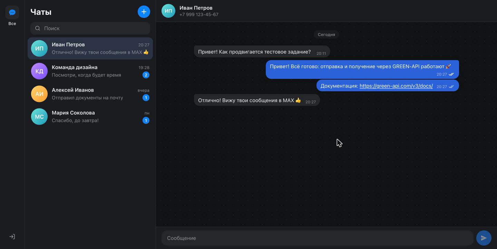
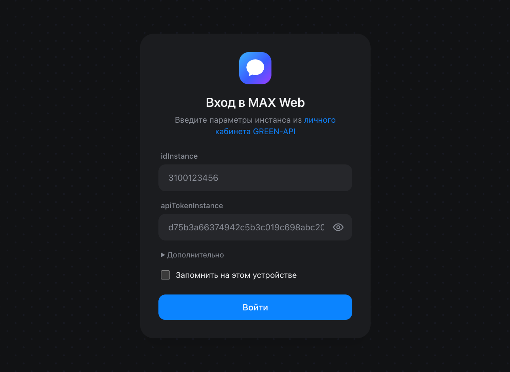
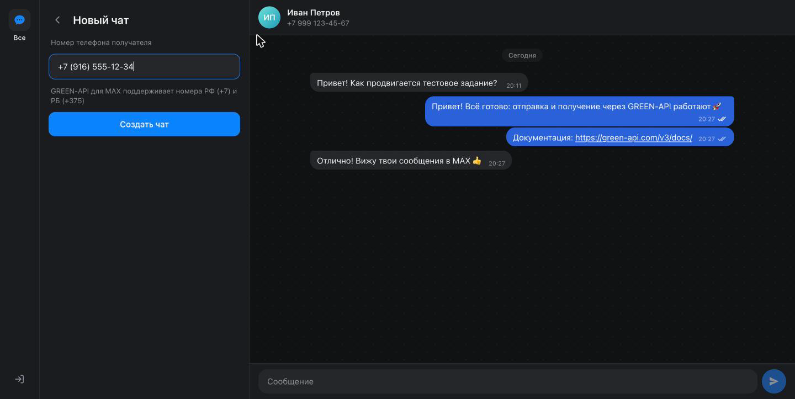
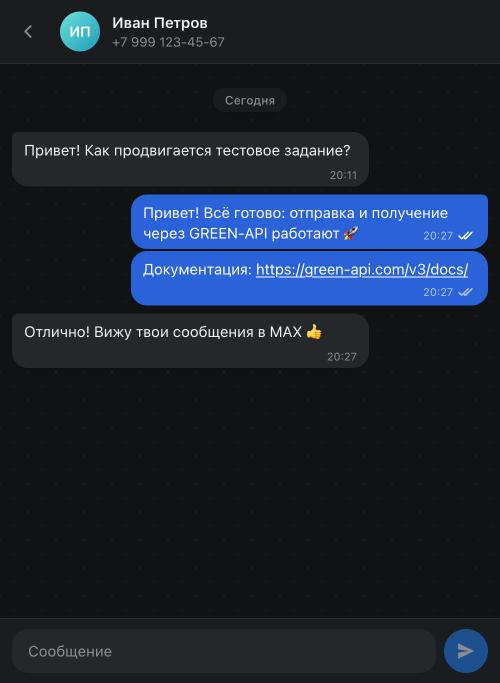
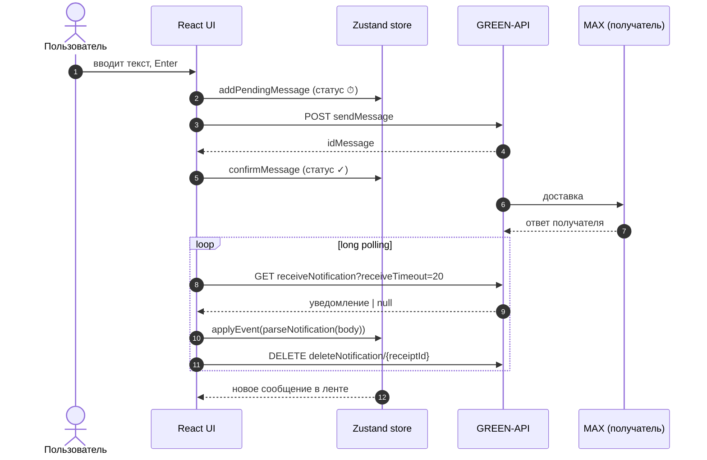

<div align="center">


# MAX Web · GREEN-API

**Веб-клиент мессенджера MAX для отправки и получения сообщений через [GREEN-API](https://green-api.com/max)**

Тестовое задание на должность «Фронтенд разработчик React»


[Демо](#-демо) · [Быстрый старт](#-быстрый-старт) · [Как проверить](#-как-проверить) · [Архитектура](#-архитектура) · [Безопасность](#-безопасность)



</div>

---

## Содержание

- [Демо](#-демо)
- [Что реализовано](#-что-реализовано)
- [Быстрый старт](#-быстрый-старт)
- [Подготовка инстанса GREEN-API](#-подготовка-инстанса-green-api)
- [Как проверить](#-как-проверить)
- [Стек](#-стек)
- [Архитектура](#-архитектура)
- [Типизация и хуки](#-типизация-и-хуки)
- [Безопасность](#-безопасность)
- [Качество и тесты](#-качество-и-тесты)
- [Деплой](#-деплой)
- [Решение проблем](#-решение-проблем)
- [Ограничения](#-ограничения)

## 🔗 Демо

| | |
| --- | --- |
| **Онлайн-версия** | _ссылка на GitHub Pages_ |
| **Видео-презентация** | _ссылка_ |
| **Исходный код** | _ссылка на репозиторий_ |

<table>
  <tr>
    <td align="center"><br /><sub>Вход по idInstance / apiTokenInstance</sub></td>
    <td align="center"><br /><sub>Новый чат по номеру телефона</sub></td>
    <td align="center"><br /><sub>Мобильная версия</sub></td>
  </tr>
</table>

## ✅ Что реализовано

### Сценарий из задания

| Шаг | Как работает |
| --- | --- |
| 1. Пользователь вводит `idInstance` и `apiTokenInstance` | Валидация полей, проверка инстанса через `getStateInstance`. Если инстанс не авторизован, спит или заблокирован, выводится понятная причина. `apiUrl` подставляется автоматически |
| 2. Вводит номер получателя и создаёт чат | Номер нормализуется: `+7 (999) 123-45-67` и `8 999…` → `79991234567`. Наличие MAX проверяется через [`CheckAccount`](https://green-api.com/v3/docs/api/service/CheckAccount/), полученный `chatId` используется для отправки |
| 3. Пишет и отправляет сообщение | [`SendMessage`](https://green-api.com/v3/docs/api/sending/SendMessage/). Сообщение появляется сразу, статусы меняются ⏱ → ✓ → ✓✓ → ✓✓ прочитано. При ошибке есть кнопка «Повторить» |
| 4–5. Получатель отвечает, ответ виден в чате | [HTTP API](https://green-api.com/v3/docs/api/receiving/technology-http-api/): long polling `ReceiveNotification` → обработка → `DeleteNotification` |

### Сверх задания

- 💬 **Как в MAX:** список чатов, поиск, счётчики непрочитанных, разделители по дням, группировка сообщений, кликабельные ссылки.
- 📥 **Входящие от новых собеседников** автоматически создают чат.
- 📱 **Сообщения, отправленные с телефона**, тоже появляются в переписке (`outgoingMessageReceived`).
- 🔌 **Индикатор соединения** «Подключение…» / «Ожидание сети…». При обрыве сети запросы повторяются с экспоненциальной задержкой.
- ✨ **Скелетоны, спиннеры, плавное появление сообщений.** Кнопка «к последним сообщениям» со счётчиком новых.
- ⌨️ **Ввод:** Enter — отправить, Shift+Enter — новая строка. Счётчик лимита 4000 символов, корректная работа с IME.
- 🌗 **Светлая и тёмная темы** по системной настройке. Адаптивная вёрстка от 320 px.
- ♿ **Доступность:** клавиатурная навигация, ARIA-разметка, `role="log"` для ленты, поддержка `prefers-reduced-motion`.
- 💾 **История сохраняется локально**, отдельно для каждого инстанса.

## 🚀 Быстрый старт

**Требования:** Node.js ≥ 22 (рекомендуется 24, см. `.nvmrc`) и Yarn 1.x.

```bash
git clone <repo-url>
cd Test_Green-API
yarn install
yarn dev
```

Откройте http://localhost:5173 и введите данные инстанса ([где их взять](#-подготовка-инстанса-green-api)).

### Production-сборка

```bash
yarn build      # проверка типов + сборка в dist/
yarn preview    # http://localhost:4173
```

### Docker

nginx с security-заголовками, запуск от непривилегированного пользователя:

```bash
docker build -t max-web .
docker run --rm -p 8080:8080 max-web    # http://localhost:8080
```

### Переменные окружения (необязательно)

Чтобы не вводить данные при каждом запуске `yarn dev`:

```bash
cp .env.example .env.local
```

| Переменная | Назначение |
| --- | --- |
| `VITE_GREEN_API_ID_INSTANCE` | `idInstance` для автозаполнения формы входа |
| `VITE_GREEN_API_TOKEN_INSTANCE` | `apiTokenInstance` для автозаполнения формы входа |
| `VITE_GREEN_API_URL` | `apiUrl`, если отличается от стандартного |

> [!IMPORTANT]
> **Только для разработки.** Vite встраивает `VITE_*` прямо в JS-бандл. Поэтому значения читаются только под `import.meta.env.DEV` и вырезаются из production-сборки. Кроме того, **сборка падает с ошибкой**, если токен из `.env` найдётся хотя бы в одном выходном файле. Файлы `.env*` не попадают в git (кроме `.env.example`).

### Скрипты

| Команда | Описание |
| --- | --- |
| `yarn dev` | dev-сервер с HMR |
| `yarn build` | проверка типов и production-сборка |
| `yarn preview` | локальный просмотр сборки |
| `yarn typecheck` | `tsc -b` в строгом режиме |
| `yarn lint` | Oxlint: предупреждения считаются ошибками |
| `yarn test` / `yarn test:watch` | Vitest + Testing Library |
| `yarn validate` | typecheck + lint + test (то же, что в CI) |

## 🔑 Подготовка инстанса GREEN-API

1. Установите мобильное приложение **MAX** и зарегистрируйтесь. Веб-версия MAX для регистрации не подходит.
2. В [личном кабинете GREEN-API](https://console.green-api.com) создайте инстанс типа **MAX**. Его `idInstance` начинается с `3100…`.
3. Авторизуйте инстанс:
   - временно отключите пароль входа в MAX;
   - в MAX откройте **Профиль → Устройства → Войти по QR-коду**;
   - отсканируйте QR-код в кабинете.

   Статус должен смениться на **Authorized** ([инструкция](https://green-api.com/v3/docs/before-start/)).
4. В настройках инстанса:
   - ✅ «Получать уведомления о входящих сообщениях и файлах» — **обязательно**;
   - ✅ «Получать уведомления о статусах отправки/доставки/прочтения» — для галочек;
   - ✅ «Получать уведомления о сообщениях, отправленных с телефона» — по желанию;
   - ⚠️ поле **webhookUrl должно быть пустым**, иначе HTTP API не отдаёт уведомления.
5. Скопируйте `idInstance` и `apiTokenInstance` в форму входа. `apiUrl` вычисляется автоматически как `https://{первые 4 цифры idInstance}.api.green-api.com`, при необходимости его можно изменить в блоке «Дополнительно».

> [!NOTE]
> **Региональные особенности MAX.** `CheckAccount` принимает номера РФ (`+7`) и РБ (`+375`). Аккаунты, зарегистрированные на номера других стран (например, `+998`), могут писать только тем, кто добавил их в контакты или написал первым ([подробнее](https://green-api.com/v3/docs/faq/registration-if-number-not-from-rf-rb/)). В таком случае попросите собеседника написать первым: чат появится в приложении автоматически.

## 🧪 Как проверить

Понадобятся два аккаунта MAX: **A** подключён к GREEN-API, **B** — любой другой (второй телефон или коллега).

1. Откройте приложение и войдите с данными инстанса аккаунта **A**.
2. Нажмите **＋**, введите номер аккаунта **B** и нажмите «Создать чат».
3. Отправьте сообщение. Оно сразу появится в ленте, затем ⏱ сменится на ✓.
4. Ответьте с аккаунта **B** в приложении MAX.
5. Ответ появится в чате через 1–2 секунды, а исходящее сообщение получит ✓✓.

> [!TIP]
> Не хотите поднимать окружение? Интеграционный тест `src/app/app.test.tsx` проходит весь сценарий на эмуляторе API: `yarn test app`.

## 🧰 Стек

| Область | Технологии |
| --- | --- |
| UI | **React 19** + **React Compiler**, **Tailwind CSS v4** (дизайн-токены в CSS-переменных) |
| Язык | **TypeScript 6** в строгом режиме: `strict`, `noUncheckedIndexedAccess`, `exactOptionalPropertyTypes`, `noImplicitOverride`, `noImplicitReturns` |
| Серверное состояние | **TanStack Query 5**: мутации входа, проверки номера и отправки со статусами загрузки и ошибок |
| Клиентское состояние | **Zustand 5** + `persist`: сессия и чаты; селекторы с `useShallow` |
| Сборка | **Vite 8**, алиас `@/` → `src/`, code splitting (мессенджер грузится лениво) |
| Качество | **Oxlint** (correctness, suspicious, react, jsx-a11y, import, vitest), **Vitest**, **Testing Library**, happy-dom |
| CI/CD | GitHub Actions: типы → линт → тесты → сборка → `yarn audit`; деплой на GitHub Pages |

## 🏗 Архитектура

Структура по мотивам [Feature-Sliced Design](https://feature-sliced.design/). Каждый модуль открывает публичный API через `index.ts`. Импорты идут только сверху вниз: `app → features → entities → shared`.

```
src/
├── app/                    композиция: провайдеры, layout, ErrorBoundary, lazy-загрузка
├── features/
│   ├── auth/               форма входа · useLogin
│   ├── chat-list/          сайдбар, поиск, новый чат по номеру · useCreateChat
│   ├── conversation/       лента, пузыри, поле ввода · useSendMessage
│   └── notifications/      цикл long polling · useNotificationPolling
├── entities/
│   ├── chat/               модель, parseNotification, store чатов, селекторы
│   └── session/            учётные данные, API-клиент в контексте, useApiMutation, статус соединения
└── shared/
    ├── api/                типизированный клиент GREEN-API и карта эндпоинтов
    ├── config/             переменные окружения (только dev)
    ├── hooks/              generic-хуки: useStickToBottom, useFilteredList, useToggle
    ├── lib/                guards, typed storage, strict context, телефоны, даты, валидация, linkify
    └── ui/                 иконки, Avatar, Spinner, Skeleton, IconButton
```

### Поток данных



### Получение сообщений

- **Один последовательный цикл на инстанс.** Он отменяется через `AbortController` при выходе или размонтировании.
- **`deleteNotification` вызывается в `finally`.** Ошибка в обработчике не блокирует очередь.
- **Повторная доставка безопасна.** Если удаление не удалось, уведомление придёт снова; store идемпотентен благодаря дедупликации по `idMessage`.
- **Восстановление после сбоев.** Ошибки сети переводят статус в `offline`, запросы повторяются с backoff от 1 до 30 с.
- **Статус соединения виден сразу.** Быстрый `getStateInstance` при старте показывает его, не дожидаясь первого long-poll.

### Отправка сообщений

- **Оптимистичная отправка.** Сообщение сразу попадает в ленту со статусом `pending` и локальным id; ответ `SendMessage` заменяет его на `idMessage`.
- **Гонки обработаны.** Если вебхук пришёл раньше HTTP-ответа, store объединяет записи без дублей.
- **Статусы только растут** (`sent → delivered → read`). Вебхуки, пришедшие не по порядку, не откатывают галочки.
- **Порядок в ленте сохраняется.** Время сервера идёт с точностью до секунды, поэтому сортировка тоже посекундная и стабильная: быстрый ответ не окажется выше вопроса.

## 🧬 Типизация и хуки

**API-клиент обобщён по карте эндпоинтов** (`shared/api/endpoints.ts`). Тело запроса, query, path и тип ответа выводятся из имени метода:

```ts
client.request('sendMessage', { body: { chatId, message } })    // Promise<SendMessageResponse>
client.request('sendFile', {})                                 // ❌ ошибка компиляции
client.request('sendMessage', {})                              // ❌ нет обязательного body
```

**Явные generic-параметры у всех хуков:**

```ts
const [query, setQuery] = useState<string>('')
const ref = useRef<HTMLDivElement>(null)
const login = useMutation<Credentials, Error, LoginVariables>({ … })
const remember = useSessionStore<boolean>((s) => s.remember)
```

**Собственные generic-хуки:**

| Хук | Назначение |
| --- | --- |
| `useApiMutation<TVariables, TData>` | `useMutation` с внедрённым API-клиентом текущего инстанса |
| `useStickToBottom<TElement, TItem>` | «липкий» скролл чата и счётчик сообщений, пришедших во время прокрутки |
| `useFilteredList<T>` | фильтрация списка с `useDeferredValue` |
| `useChatStore<T>` / `useChatStoreShallow<T>` | подписка на срез store; готовые селекторы `useChat`, `useChatMessages`, `useSortedChats`, `useLastMessage`, `useChatActions` |

Каждая строка списка чатов подписана только на своё последнее сообщение. Новое сообщение перерисовывает одну строку, а не весь список.

**Generic-утилиты:**

| Утилита | Назначение |
| --- | --- |
| `createStrictContext<T>` | контекст и хук, который падает при использовании вне провайдера |
| `createTypedStorage<T>` | Web Storage с проверкой type guard при каждом чтении |
| `shape<S>` | type guard, тип которого выводится из схемы |
| `compact<T>` | убирает `undefined`-поля под `exactOptionalPropertyTypes` |
| `assertNever` | проверка исчерпывающей обработки union-типов |

Бизнес-логика вынесена из компонентов в хуки: `useLogin`, `useCreateChat`, `useSendMessage`, `useNotificationPolling`. Типы проверяются тестами: `expectTypeOf` и `@ts-expect-error` (через `tsc`).

## 🔒 Безопасность

| Угроза | Защита |
| --- | --- |
| Утечка токена на чужой хост | `apiUrl` принимается только в виде `https://*.green-api.com` без пути, логина и параметров. Проверка стоит в форме, в конструкторе API-клиента и в `connect-src` политики CSP |
| XSS | Нет `dangerouslySetInnerHTML` (запрещено линтером). Ссылки в сообщениях — только `http(s)`, с `rel="noopener noreferrer nofollow"`. Production-сборка получает **CSP**: `default-src 'self'`, без inline-скриптов и `eval`, `object-src 'none'`, `base-uri 'none'` |
| Кража сохранённого токена | По умолчанию токен и история лежат в `sessionStorage` и стираются при закрытии вкладки. `localStorage` используется только при явном «Запомнить на этом устройстве». «Выйти» удаляет токен и историю инстанса |
| Подмена данных в хранилище | Сохранённые данные проходят повторную валидацию type guard при чтении |
| Токен в бандле | `.env` работает только в dev. Сборка падает, если найдёт секрет в выходных файлах |
| Утечка через Referer и кэш | `referrerPolicy: 'no-referrer'`, `credentials: 'omit'`, `cache: 'no-store'`, `<meta name="referrer" content="no-referrer">`. Тексты ошибок не содержат URL запроса |
| Недоверенные уведомления | Форма каждого уведомления проверяется в рантайме; некорректные игнорируются |
| Clickjacking и прочее | `deploy/nginx.conf`: `frame-ancestors 'none'`, `X-Frame-Options`, `nosniff`, HSTS, `Permissions-Policy`, COOP |
| Блокировка аккаунта MAX | Повторное создание чата с известным номером не вызывает `CheckAccount`: частые проверки номеров могут привести к ограничениям |
| Уязвимые зависимости | `yarn audit` в CI. На момент сдачи 0 уязвимостей и ни одного deprecated API (проверено TypeScript language service) |

> [!WARNING]
> Токен по природе API передаётся в URL и доступен в браузере пользователя. Это допустимо для персонального клиента. Для мультипользовательского продукта запросы стоит проксировать через свой backend, а уведомления получать через webhook.

## 📊 Качество и тесты

```bash
yarn validate    # typecheck + lint + test
```

**49 тестов**, включая проверки типов:

| Область | Что проверяется |
| --- | --- |
| API-клиент | формирование URL и тела, маппинг HTTP-ошибок, отмена и таймауты, защита от чужого хоста, типы карты эндпоинтов |
| Разбор уведомлений | текст и extended text, статусы, неподдерживаемые типы, группы, «битые» данные |
| Store | дедупликация, порядок, счётчики непрочитанного, оптимистичная отправка, гонка вебхука и HTTP-ответа, монотонность статусов, лимит истории |
| Цикл опроса | удаление при ошибке обработчика, backoff, статусы соединения |
| Generic-хуки и утилиты | `useStickToBottom`, `useFilteredList`, `useToggle`, `shape`, `compact`, `createTypedStorage` |
| **Интеграционный** | весь сценарий задания: вход → новый чат → отправка → ответ и «прочитано» → выход с очисткой данных; ошибки входа и неизвестного номера; блокировка чужого `apiUrl` |

## 🌍 Деплой

- **GitHub Pages:** workflow `.github/workflows/deploy.yml` собирает и публикует сайт при пуше в `main`. В настройках репозитория выберите Settings → Pages → Source: **GitHub Actions**. Сборка использует относительный `base`, поэтому работает в подкаталоге `/<repo>/`.
- **Docker / любой статический хостинг:** см. `Dockerfile` и `deploy/nginx.conf`.

## 🩺 Решение проблем

| Симптом | Причина и решение |
| --- | --- |
| «Неверный idInstance или apiTokenInstance» | Скопируйте данные из кабинета заново; токен мог быть перевыпущен |
| «Инстанс не авторизован…» | Отсканируйте QR-код в кабинете (п. 3 [подготовки](#-подготовка-инстанса-green-api)) |
| Баннер «…custom webhook url is set…» | Очистите поле webhookUrl в настройках инстанса и подождите около минуты |
| Сообщения отправляются, ответы не приходят | Включите «Получать уведомления о входящих сообщениях»; проверьте, что приложение не открыто во второй вкладке |
| «Этот номер не зарегистрирован в MAX» | На номере нет аккаунта MAX, либо номер не РФ/РБ (см. [региональные особенности](#-подготовка-инстанса-green-api)) |
| «Превышены лимиты тарифа GREEN-API» | Лимит тарифа Developer исчерпан — дождитесь сброса или смените тариф |
| Висит «Ожидание сети…» | Нет связи с `*.green-api.com`: проверьте интернет, VPN и блокировщики |

## ⚠️ Ограничения

- **Только личные чаты и текстовые сообщения**, по условию задания. Другие типы показываются заглушкой, группы игнорируются.
- **История ведётся с момента входа.** Загрузка истории с сервера (`GetChatHistory`) условием не требовалась.
- **Очередь уведомлений у инстанса одна.** Если открыть приложение в нескольких вкладках, уведомления распределятся между ними.

---

<div align="center">
<sub>Рамиль Камалов · 2026</sub>
</div>
